

  

  

  &nbsp;
  &nbsp;
  

  
  
  

---

# 👨‍💻 Sobre mim

Olá! Me chamo **Isaque Pereira**, sou um **Desenvolvedor Júnior Backend** apaixonado por tecnologia, interfaces modernas e desenvolvimento de sistemas escaláveis.

Atualmente estou focado em construir aplicações web completas, APIs robustas e soluções digitais voltadas para automação, gestão e experiência do usuário.

Tenho experiência com desenvolvimento utilizando:

- ☕ Java
- ⚛️ React
- 🟩 Node.js
- 🔷 TypeScript
- 🗄️ PostgreSQL & Supabase
- ☁️ Vercel

Além do desenvolvimento, também possuo forte interesse em:

- 🎨 Design UI/UX
- 🖌️ Branding
- 📱 Interfaces modernas
- 🚀 Performance e arquitetura

Meu objetivo é evoluir constantemente como desenvolvedor e transformar ideias em produtos reais e funcionais.

---

# 🚀 Portfólio

🌐 Meu site pessoal:

👉 https://isaquedev.vercel.app/

No meu portfólio você encontra:
- Projetos desenvolvidos
- Tecnologias que utilizo
- Informações profissionais
- Contato direto
- Identidade visual personalizada

---

# 🛠️ Tecnologias & Ferramentas

<table>
<tr>

<td align="center" width="220">

## 💻 Back-end

 

  

  

</td>

<td align="center" width="220">

## 🎨 Front-end

 

  

  

</td>

<td align="center" width="220">

## ⚛️ Frameworks

 

  

  

</td>

</tr>
</table>

 

<table>
<tr>

<td align="center" width="220">

## 🗄️ Banco de Dados

 

  

</td>

<td align="center" width="220">

## 🧰 IDE's

 

  

  

</td>

<td align="center" width="220">

## ☁️ DevOps & Ferramentas

 

  

  

</td>

</tr>
</table>

 

<table>
<tr>

<td align="center" width="220">

## 🎨 CSS Frameworks

 

  

</td>

<td align="center" width="220">

## 🎯 Estudando

 

  

  

</td>

</tr>
</table>

---

# 🚀 Projetos em Destaque

<table>
<tr>

<td width="50%" align="center">

### 🌐 Portfólio Pessoal

Sistema desenvolvido para apresentar meus projetos, habilidades e identidade visual profissional.

**Tecnologias:**  
React • TypeScript • Vercel

</td>

<td width="50%" align="center">

### ⚙️ Projeto BackEnd - FrameWorks

Aplicação backend robusta utilizando Java com frameworks modernos, focada em boas práticas e arquitetura limpa.

**Tecnologias:**  
Java • Spring Boot • PostgreSQL

</td>

</tr>
</table>

---

# 💰 Le Sorvet — Sistema de Gestão Financeira

Sistema completo de organização e gestão financeira com foco em experiência do usuário e escalabilidade.

**Tecnologias:** React Native • Node.js • Supabase

<table>
<tr>
<td align="center"></td>
<td align="center">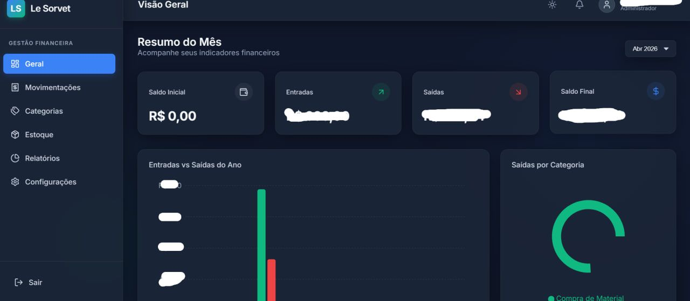</td>
<td align="center">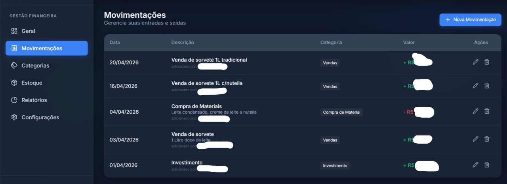</td>
</tr>
<tr>
<td align="center">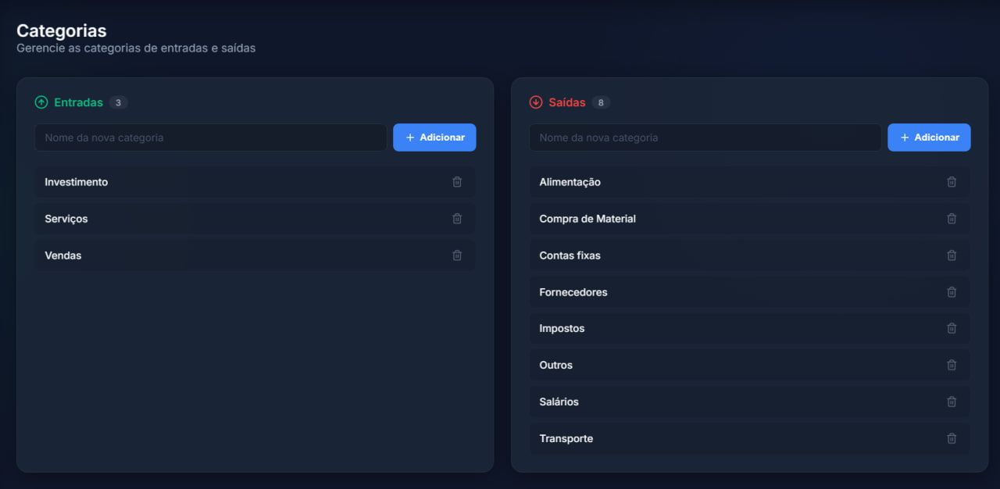</td>
<td align="center">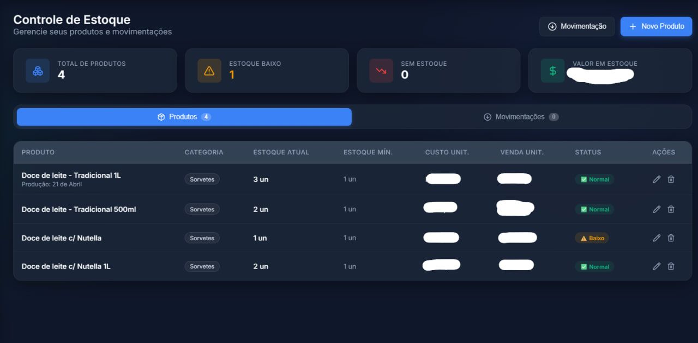</td>
<td align="center">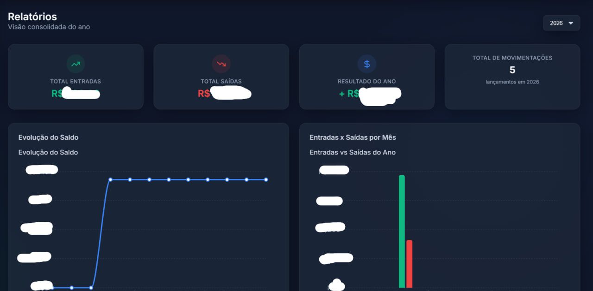</td>
</tr>
<tr>
<td align="center">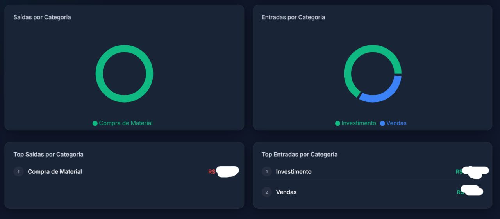</td>
<td align="center">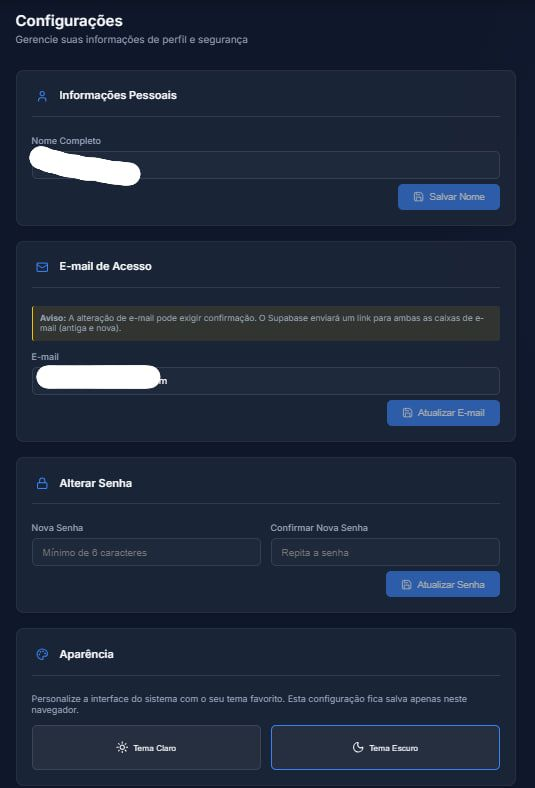</td>
<td align="center">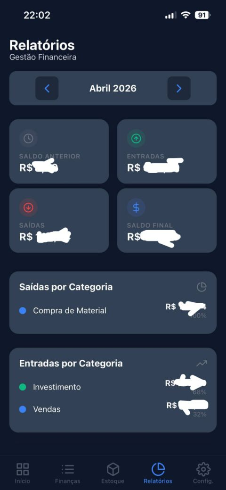</td>
</tr>
<tr>
<td align="center">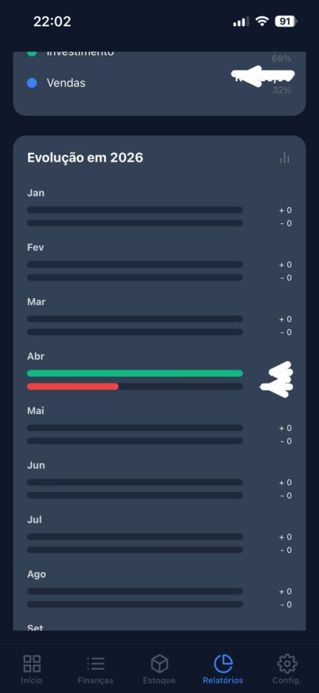</td>
<td align="center">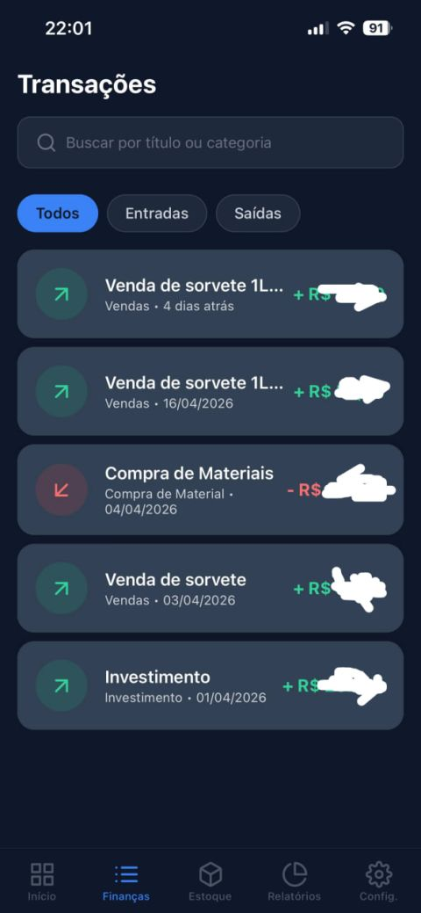</td>
<td align="center">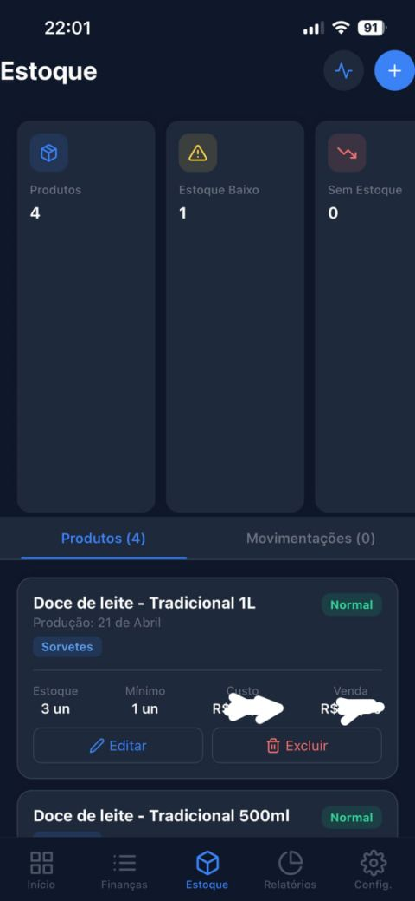</td>
</tr>
<tr>
<td align="center">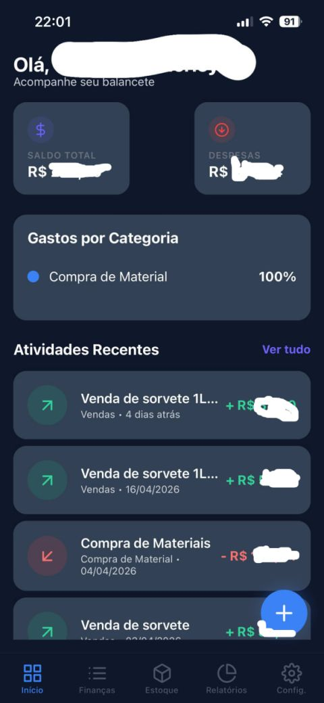</td>
<td align="center"></td>
<td align="center">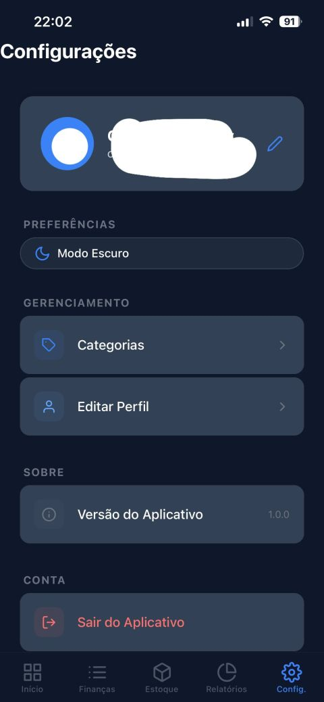</td>
</tr>
</table>

---

# 🌐 Sites Desenvolvidos

<table>
<tr>

<td width="33%" align="center">

### 🎬 Pedro Fidelis

**Site Institucional · Edição de Vídeos**

Site institucional completo para apresentação dos serviços de edição de vídeos do Pedro Fidelis.

</td>

<td width="33%" align="center">

### 🎬 Alykis Silva

**Site Institucional · Edição de Vídeos**

Presença online profissional para o editor Alykis Silva, com portfólio e contato integrados.

</td>

<td width="33%" align="center">

### ⭐ Wa Prime Clean

**Site Institucional · Empresa de Limpeza**

Site institucional para empresa de limpeza com base nos EUA, focado em captar clientes locais.

</td>

</tr>
<tr>

<td width="33%" align="center">

### 🎨 Mauricio Nunes

**Site Perfil Profissional · Mauricio Design**

Portfólio profissional de design para Mauricio Nunes, com apresentação elegante de projetos.

</td>

<td width="33%" align="center">

### 💈 Honor BarberShop

**Sistema · Agendamento & E-mails**

Sistema completo de agendamento online e envio automático de e-mails de confirmação para barbearia.

</td>

<td width="33%" align="center">
</td>

</tr>
</table>

---

# 🚀 Minhas estatísticas no GitHub

 

---

# 🐍 Contribuições

<picture>
  <source media="(prefers-color-scheme: dark)" srcset="https://raw.githubusercontent.com/isaquexxz/isaquexxz/output/github-contribution-grid-snake-dark.svg" />
  <source media="(prefers-color-scheme: light)" srcset="https://raw.githubusercontent.com/isaquexxz/isaquexxz/output/github-contribution-grid-snake-dark.svg" />
  
</picture>

 

  

---

# 🤝 Vamos nos conectar?

  &nbsp;&nbsp;&nbsp;
  &nbsp;&nbsp;&nbsp;
  

  Aberto a networking, colaborações e oportunidades. 
  Se quiser trocar uma ideia, me chama! 🤜

---

  

